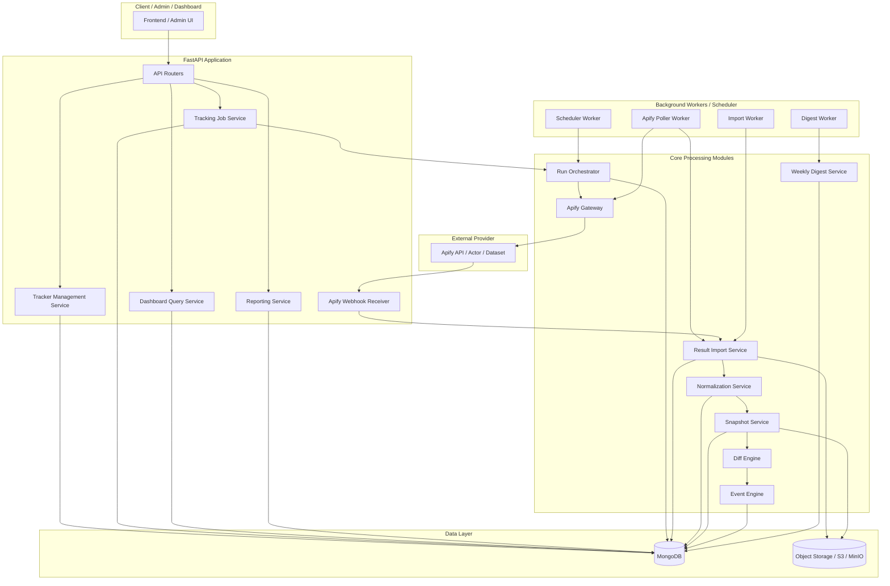
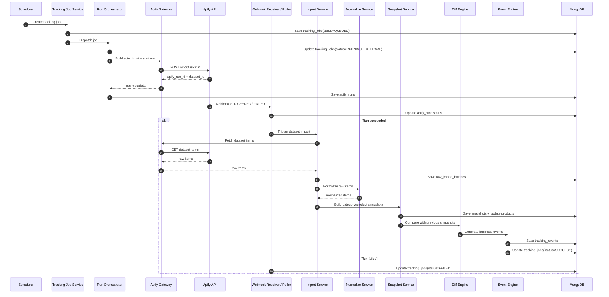

# BE_ARCHITECTURE.md

## 1. Purpose

This document defines the backend architecture for the Market Tracker system.

The backend is responsible for:

- managing category and competitor trackers
- orchestrating external data acquisition via Apify
- importing and normalizing provider data
- creating internal snapshots
- deriving business events
- serving dashboard and reporting APIs

The backend **does not perform direct crawling**.

---

## 2. Architecture Goals

1. **Keep external data acquisition replaceable**  
   Apify integration must be isolated behind a gateway and binding layer.

2. **Preserve business ownership of state**  
   Internal jobs, snapshots, and events must remain fully owned by the backend.

3. **Optimize for reproducibility**  
   A given imported dataset should produce deterministic normalized snapshots and events.

4. **Prefer simple operational topology**  
   For MVP and early scale, a modular monolith with background workers is preferred over microservices.

5. **Design for evolution**  
   New tracker types, event rules, or external providers should fit without major rewrites.

---

## 3. High-Level Architecture



---

## 4. Architectural Style

### 4.1 Primary style
**Modular monolith + background workers**

This is the recommended architecture because:

- domain complexity is moderate
- throughput is manageable in early phases
- business logic changes quickly
- operational simplicity is valuable

### 4.2 Why not microservices yet

Microservices would add unnecessary complexity in:

- deployment
- observability
- transaction boundaries
- operational debugging
- schema evolution

The product’s primary complexity lies in **workflow correctness**, **data normalization**, and **event semantics**, not independent service scaling.

---

## 5. Logical Domains

The backend is divided into the following logical domains.

| Domain | Responsibility |
|---|---|
| Tracker Management | CRUD and validation for category/competitor trackers. |
| Provider Integration | Encapsulates all Apify-specific APIs and lifecycle handling. |
| Execution Orchestration | Creates and manages internal tracking jobs and external runs. |
| Ingestion | Imports dataset items from Apify into internal storage. |
| Normalization | Maps provider-specific payloads into stable internal models. |
| Snapshoting | Persists normalized category and product snapshots. |
| Event Intelligence | Computes business events from snapshot differences. |
| Query & Reporting | Serves dashboard APIs, timelines, event feeds, and weekly digests. |
| Operations | Scheduling, polling, retrying, monitoring, and failure recovery. |

---

## 6. Module Breakdown

## 6.1 `tracker_management`

**Responsibility**

- create/update/archive trackers
- validate tracker scope and schedule
- manage ASIN lists for competitor trackers

**Owns**

- `category_trackers`
- `competitor_trackers`

**Does not own**

- external run lifecycle
- snapshot generation
- event computation

---

## 6.2 `apify_gateway`

**Responsibility**

- isolate all communication with Apify APIs
- start actor/task runs
- get run status
- fetch dataset items
- handle provider-specific errors/timeouts/retries

**Design rule**

No other module should call Apify directly.

**Benefits**

- provider replaceability
- easier testing
- cleaner fault isolation
- minimal provider leakage into domain logic

---

## 6.3 `run_orchestrator`

**Responsibility**

- translate tracker config into execution requests
- create internal jobs
- invoke external Apify runs
- maintain state transitions across execution phases

**Owns**

- `tracking_jobs`
- coordination with `apify_runs`

**Key design rule**

The orchestrator owns **business execution intent**, not scraping implementation.

---

## 6.4 `webhook_receiver`

**Responsibility**

- receive Apify webhook callbacks
- validate callback authenticity
- update external run state
- trigger import flow

**Fallback**

If webhooks are unavailable or delayed, polling can be used.

---

## 6.5 `result_importer`

**Responsibility**

- fetch dataset items from Apify
- persist raw import batches
- hand off imported data for normalization
- enforce import idempotency

**Boundary**

This is the point where provider data becomes internal data.

---

## 6.6 `normalization_service`

**Responsibility**

- convert provider-specific fields to internal schema
- standardize enums and formats
- compute hashes/signatures used for change detection

**Examples**

- normalize price values
- normalize availability states
- compute `title_hash`
- compute `main_image_hash`
- compute `variation_signature_hash`
- compute `content_signature_hash`

**Key principle**

Normalization must be deterministic and version-aware.

---

## 6.7 `snapshot_service`

**Responsibility**

- create normalized category snapshots
- create normalized product snapshots
- update the product registry
- preserve append-only snapshot history

**Outputs**

- `category_snapshots`
- `product_snapshots`
- updated `products`

---

## 6.8 `diff_engine`

**Responsibility**

- compare current snapshots with previous snapshots
- determine whether business-significant changes occurred
- prepare raw event candidates

**Examples**

- first appearance in Top 50
- Top 10 entry/exit
- price change
- title change
- image change
- availability change

---

## 6.9 `event_engine`

**Responsibility**

- apply event rules
- build event payloads
- assign severity
- deduplicate and persist events

**Outputs**

- `tracking_events`

---

## 6.10 `dashboard_query`

**Responsibility**

- power all read-heavy product/dashboard APIs
- serve current state, timelines, summaries, and event feeds

**Primary read sources**

- `products`
- `category_snapshots`
- `product_snapshots`
- `tracking_events`
- `weekly_digests`

---

## 6.11 `report_service`

**Responsibility**

- generate weekly digests
- produce summary exports
- aggregate threats and major changes for a time window

---

## 6.12 `ops_monitoring`

**Responsibility**

- scheduler
- polling
- retry policies
- dead-letter handling
- execution observability

---

## 7. Runtime Flow



---

## 8. State Machines

## 8.1 Tracking job state machine

| State | Meaning |
|---|---|
| `QUEUED` | Job created but not yet dispatched. |
| `DISPATCHING` | Backend is preparing and sending the external run request. |
| `RUNNING_EXTERNAL` | External Apify run is in progress. |
| `IMPORTING` | Dataset results are being imported into internal storage. |
| `PROCESSING` | Normalization, snapshot creation, and event generation are running. |
| `SUCCESS` | End-to-end processing completed successfully. |
| `PARTIAL_SUCCESS` | Job produced partial output but not full expected result. |
| `FAILED` | Job failed and did not produce valid internal output. |

## 8.2 Apify run state machine

| State | Meaning |
|---|---|
| `READY` | External run created but not executing yet. |
| `RUNNING` | External run is currently executing. |
| `SUCCEEDED` | External run completed successfully. |
| `FAILED` | External run failed. |
| `TIMED_OUT` | External run exceeded the allowed execution limit. |
| `ABORTED` | External run was aborted externally or by policy. |

---

## 9. Core Data Flow Principles

### 9.1 Internal truth vs external truth

| Concern | System of Record |
|---|---|
| Tracker configuration | Internal backend |
| Job lifecycle | Internal backend |
| External run metadata | Internal backend copy of Apify run state |
| Raw provider payload | Internal imported batch / object storage |
| Snapshot history | Internal backend |
| Business events | Internal backend |

### 9.2 Append-only history

Snapshots and events are append-only. Mutable “latest state” is limited to:

- tracker metadata
- product registry current state
- run/job statuses

This reduces ambiguity and improves reproducibility.

---

## 10. Failure Handling Strategy

## 10.1 Failure classes

1. **Dispatch failures**  
   Failed to create an Apify run.

2. **Lifecycle tracking failures**  
   Webhook missing, delayed, or provider state fetch failed.

3. **Import failures**  
   Dataset items unavailable, malformed, incomplete, or too large.

4. **Normalization failures**  
   Required fields missing or mapping incompatible.

5. **Snapshot failures**  
   Idempotency conflict or schema-level write issues.

6. **Event failures**  
   Rule engine exception or dedupe conflict.

### 10.2 Recovery principles

- fail independently where possible
- record enough metadata for replay
- keep raw imports or storage references for reprocessing
- never partially overwrite finalized historical snapshots
- use explicit statuses, not implicit assumptions

---

## 11. Idempotency Strategy

## 11.1 Job creation
A tracker should produce at most one logical job per `snapshot_date`.

## 11.2 External run persistence
An Apify run should be stored once per `apify_run_id`.

## 11.3 Import batches
Each imported dataset batch must be unique per `(apify_run_id, batch_no)`.

## 11.4 Snapshot writes
A normalized snapshot must be unique per logical identity:

- category: `(category_tracker_id, snapshot_date)`
- product: `(marketplace, asin, snapshot_date)`

## 11.5 Event writes
Each event must have a stable dedupe key derived from event type + identity + date/scope.

---

## 12. Observability

The system should expose structured logs and metrics for:

### 12.1 Logs
- job creation
- external run dispatch
- webhook receipt
- import completion
- normalization failures
- snapshot write conflicts
- event emission counts

### 12.2 Metrics
- jobs created / succeeded / failed
- Apify run latency
- import lag
- normalization error rate
- snapshot creation latency
- events emitted per job
- digest generation latency

### 12.3 Tracing
Recommended correlation keys:

- `job_code`
- `tracker_code`
- `apify_run_id`
- `snapshot_date`

---

## 13. Security & Access Boundaries

### 13.1 External API secrets
Apify tokens must be stored in secret management, never in code or long-lived logs.

### 13.2 Internal APIs
Webhook endpoints should be restricted and verified.

### 13.3 Data minimization
Only store raw payloads that are operationally useful. Large redundant payloads should be offloaded.

---

## 14. Deployment Topology

### Recommended MVP topology

- 1 FastAPI application
- 1 worker process pool
- 1 scheduler worker
- 1 poller worker
- MongoDB
- object storage
- external Apify integration

This architecture is sufficient for early-stage scale and keeps operations straightforward.

---

## 15. Suggested Folder Structure

```text
app/
  api/
    v1/
      category_trackers.py
      competitor_trackers.py
      jobs.py
      products.py
      events.py
      reports.py
      webhooks_apify.py

  core/
    config.py
    database.py
    logging.py

  models/
    category_tracker.py
    competitor_tracker.py
    apify_actor_binding.py
    tracking_job.py
    apify_run.py
    raw_import_batch.py
    product.py
    category_snapshot.py
    product_snapshot.py
    tracking_event.py
    weekly_digest.py

  schemas/
    tracker.py
    job.py
    product.py
    event.py
    report.py
    webhook.py

  integrations/
    apify_gateway.py

  services/
    tracker_service.py
    run_orchestrator.py
    apify_run_service.py
    import_service.py
    normalization_service.py
    snapshot_service.py
    diff_service.py
    event_service.py
    report_service.py

  workers/
    scheduler_worker.py
    poller_worker.py
    import_worker.py
    digest_worker.py
```

---

## 16. Non-Goals

This backend architecture intentionally excludes:

- browser automation orchestration
- proxy rotation management
- per-request scrape retries at HTML/request level
- low-level crawling logic

Those concerns belong to the external provider integration domain, not the product backend.

---

## 17. Final Notes

This architecture is “world-class” not because it is complex, but because it is:

- explicit about ownership boundaries
- reproducible
- idempotent
- observable
- evolvable

It treats provider execution, internal business state, and user-facing read models as distinct concerns and keeps them cleanly separated.
