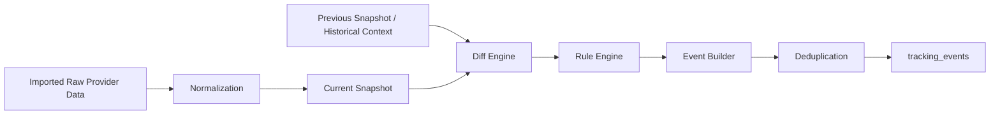

# EVENT_LOGIC.md

## 1. Purpose

This document defines the event logic for the Market Tracker backend.

Events are **derived business signals** generated by comparing normalized snapshots across time. They are not provider-native signals and must be reproducible from internal state.

This document specifies:

- what each event means
- when each event should be triggered
- required input fields
- expected payload shape
- deduplication rules
- key edge cases

---

## 2. Core Principles

1. **Events are derived from normalized snapshots**  
   No event should depend directly on raw provider payload alone.

2. **Events must be reproducible**  
   Given the same snapshots and rules, the same events must be generated.

3. **Events must be idempotent**  
   Retrying the same processing flow must not create duplicate events.

4. **Events should represent business significance**  
   Not every field change should become an event.

5. **Events should remain explainable**  
   Every event must be traceable to the source snapshots that produced it.

---

## 3. Event Processing Pipeline



---

## 4. Event Categories

| Category | Description |
|---|---|
| Category Movement Events | Events derived from Top-N category ranking changes. |
| Product Change Events | Events derived from product-level state changes over time. |
| System/Operational Events | Optional internal lifecycle events, not the focus of this document. |

This document focuses on **business events**, not low-level operational telemetry.

---

## 5. Required Inputs by Event Family

## 5.1 Category movement inputs

Required data:

- current category snapshot
- previous category snapshot
- tracker identity
- historical presence/absence of ASIN in tracker history

Key fields:

- `asin`
- `rank_position`
- `snapshot_date`
- `category_tracker_id`

## 5.2 Product change inputs

Required data:

- current product snapshot
- previous product snapshot
- marketplace + ASIN identity
- normalized listing/commercial fields

Key fields:

- `marketplace`
- `asin`
- `commercial.price_current`
- `commercial.price_original`
- `commercial.coupon_text`
- `availability.availability_status`
- `availability.buy_box_status`
- `listing.title_hash`
- `listing.main_image_hash`
- `listing.variation_signature_hash`
- `listing.a_plus_signature_hash`
- `listing.content_signature_hash`

---

## 6. Event Catalog

## 6.1 `NEW_ENTRANT_TOP50`

### Meaning
A product appears in the tracked Top 50 for the first time since tracking began.

### Trigger condition
Emit when:

- the product exists in the current category snapshot
- the product has **never appeared before** in any historical snapshot for the same category tracker

### Required inputs
- `category_tracker_id`
- current snapshot ASIN set
- historical existence lookup by tracker + ASIN

### Suggested severity
`MEDIUM`

### Example payload
```json
{
  "rank_today": 32,
  "first_seen_in_tracker": true
}
```

### Dedupe key
```text
NEW_ENTRANT_TOP50|{tracker_id}|{asin}|{snapshot_date}
```

### Edge cases
- Do not emit if historical data is incomplete and presence cannot be determined confidently.
- Do not emit for reprocessing if the same dedupe key already exists.

---

## 6.2 `RETURNING_TOP50`

### Meaning
A product re-enters the tracked Top 50 after previously dropping out.

### Trigger condition
Emit when:

- the product exists in the current snapshot
- the product existed at some earlier time in the same tracker history
- the product does **not** exist in the immediately previous snapshot

### Required inputs
- current snapshot ASIN set
- previous snapshot ASIN set
- historical presence lookup

### Suggested severity
`MEDIUM`

### Example payload
```json
{
  "rank_today": 39,
  "last_seen_date": "2026-03-20",
  "days_absent": 4
}
```

### Dedupe key
```text
RETURNING_TOP50|{tracker_id}|{asin}|{snapshot_date}
```

### Edge cases
- If the product existed yesterday, this is not a returning event.
- If historical data before yesterday is missing, avoid false classification.

---

## 6.3 `EXIT_TOP50`

### Meaning
A product exits the tracked Top 50.

### Trigger condition
Emit when:

- the product exists in the previous snapshot
- the product does **not** exist in the current snapshot

### Required inputs
- previous snapshot ASIN set
- current snapshot ASIN set

### Suggested severity
`LOW`

### Example payload
```json
{
  "previous_rank": 47,
  "present_today": false
}
```

### Dedupe key
```text
EXIT_TOP50|{tracker_id}|{asin}|{snapshot_date}
```

### Edge cases
- If today’s snapshot is incomplete or import failed partially, do not emit exit events.
- Exit events should only be generated from a validated snapshot.

---

## 6.4 `ENTER_TOP10`

### Meaning
A product enters the Top 10 zone inside the tracked category.

### Trigger condition
Emit when:

- current rank is `<= 10`
- previous rank is `> 10` or not present

### Required inputs
- previous rank
- current rank

### Suggested severity
`HIGH`

### Example payload
```json
{
  "previous_rank": 14,
  "current_rank": 9
}
```

### Dedupe key
```text
ENTER_TOP10|{tracker_id}|{asin}|{snapshot_date}
```

### Edge cases
- If the product is also a new entrant and lands directly in Top 10, both `NEW_ENTRANT_TOP50` and `ENTER_TOP10` may be emitted.
- If business decides to reduce noise, the engine may suppress one of them through policy, not through detection logic.

---

## 6.5 `EXIT_TOP10`

### Meaning
A product leaves the Top 10 zone.

### Trigger condition
Emit when:

- previous rank is `<= 10`
- current rank is `> 10` or missing from current Top 50

### Required inputs
- previous rank
- current rank or absence

### Suggested severity
`MEDIUM`

### Example payload
```json
{
  "previous_rank": 8,
  "current_rank": 13
}
```

### Dedupe key
```text
EXIT_TOP10|{tracker_id}|{asin}|{snapshot_date}
```

### Edge cases
- If the current snapshot is not trustworthy, do not emit.
- Exiting Top 10 and exiting Top 50 may occur together and may both be recorded if business rules allow.

---

## 6.6 `PRICE_CHANGED`

### Meaning
The normalized selling price changed compared with the previous snapshot.

### Trigger condition
Emit when one or both of the following changed:

- `commercial.price_current`
- `commercial.price_original`

### Required inputs
- previous commercial block
- current commercial block

### Suggested severity
`MEDIUM`

### Example payload
```json
{
  "previous": {
    "price_current": 34.99,
    "price_original": 39.99
  },
  "current": {
    "price_current": 29.99,
    "price_original": 39.99
  },
  "delta": {
    "price_current_abs": -5.0,
    "price_current_pct": -14.29
  }
}
```

### Dedupe key
```text
PRICE_CHANGED|{marketplace}|{asin}|{snapshot_date}
```

### Edge cases
- Price parsing must be normalized before comparison.
- Ignore cosmetic formatting changes that do not change numeric value.

---

## 6.7 `PROMOTION_CHANGED`

### Meaning
A promotion or coupon state changed.

### Trigger condition
Emit when:

- normalized `commercial.coupon_text` changed
- or promotion flags changed in normalized form

### Required inputs
- previous coupon/promotion data
- current coupon/promotion data

### Suggested severity
`LOW` or `MEDIUM`

### Example payload
```json
{
  "previous": {
    "coupon_text": null
  },
  "current": {
    "coupon_text": "10% off"
  }
}
```

### Dedupe key
```text
PROMOTION_CHANGED|{marketplace}|{asin}|{snapshot_date}
```

### Edge cases
- Provider-side rendering noise should be normalized aggressively.
- Do not emit if promotion extraction confidence is below threshold, if confidence scoring is implemented.

---

## 6.8 `TITLE_CHANGED`

### Meaning
The product title changed materially.

### Trigger condition
Emit when:

- `listing.title_hash` changed
- after title normalization has already been applied

### Required inputs
- previous normalized title/hash
- current normalized title/hash

### Suggested severity
`MEDIUM`

### Example payload
```json
{
  "previous": {
    "title": "Example Product 2025 Edition"
  },
  "current": {
    "title": "Example Product New 2026 Edition"
  }
}
```

### Dedupe key
```text
TITLE_CHANGED|{marketplace}|{asin}|{snapshot_date}
```

### Edge cases
- Whitespace-only or case-only differences should not emit events.
- Title normalization version changes should be managed carefully to avoid mass false positives.

---

## 6.9 `MAIN_IMAGE_CHANGED`

### Meaning
The primary image changed.

### Trigger condition
Emit when:

- `listing.main_image_hash` changed
- or, as a fallback, normalized `main_image_url` changed

### Required inputs
- previous image hash/url
- current image hash/url

### Suggested severity
`MEDIUM`

### Example payload
```json
{
  "previous": {
    "main_image_url": "https://example.com/img1.jpg"
  },
  "current": {
    "main_image_url": "https://example.com/img2.jpg"
  }
}
```

### Dedupe key
```text
MAIN_IMAGE_CHANGED|{marketplace}|{asin}|{snapshot_date}
```

### Edge cases
- Prefer content hash over URL if URL volatility is high.
- CDN parameter-only changes should not emit if the underlying asset is unchanged.

---

## 6.10 `VARIATIONS_ADDED`

### Meaning
The set of product variations expanded.

### Trigger condition
Emit when:

- `listing.variation_signature_hash` changed
- and the normalized variation count increased

### Required inputs
- previous variation signature/count
- current variation signature/count

### Suggested severity
`LOW` or `MEDIUM`

### Example payload
```json
{
  "previous": {
    "variation_count": 3
  },
  "current": {
    "variation_count": 5
  }
}
```

### Dedupe key
```text
VARIATIONS_ADDED|{marketplace}|{asin}|{snapshot_date}
```

### Edge cases
- Signature change without count increase may indicate reordering or replacement, not necessarily addition.
- Emit only when business semantics clearly indicate expansion.

---

## 6.11 `CONTENT_CHANGED`

### Meaning
The product’s descriptive content changed materially.

### Trigger condition
Emit when one of the following changed:

- `listing.content_signature_hash`
- `listing.a_plus_signature_hash`

### Required inputs
- previous content signature(s)
- current content signature(s)

### Suggested severity
`LOW`

### Example payload
```json
{
  "previous": {
    "content_signature_hash": "hash_old"
  },
  "current": {
    "content_signature_hash": "hash_new"
  }
}
```

### Dedupe key
```text
CONTENT_CHANGED|{marketplace}|{asin}|{snapshot_date}
```

### Edge cases
- This event is best-effort and may be noisy if provider output is unstable.
- Dynamic fragments should be stripped during normalization to reduce false positives.

---

## 6.12 `AVAILABILITY_CHANGED`

### Meaning
The normalized availability state changed.

### Trigger condition
Emit when `availability.availability_status` changed.

### Required inputs
- previous availability status
- current availability status

### Suggested severity
`HIGH` if product becomes unavailable; otherwise `MEDIUM`

### Example payload
```json
{
  "previous": {
    "availability_status": "IN_STOCK"
  },
  "current": {
    "availability_status": "OUT_OF_STOCK"
  }
}
```

### Dedupe key
```text
AVAILABILITY_CHANGED|{marketplace}|{asin}|{snapshot_date}
```

### Edge cases
- Unknown/unparsed values should be mapped consistently before comparison.
- Treat `UNKNOWN` transitions cautiously to avoid noise.

---

## 6.13 `BUY_BOX_CHANGED`

### Meaning
The normalized Buy Box state changed.

### Trigger condition
Emit when one of the following changed:

- `availability.buy_box_status`
- `availability.buy_box_seller_name` (if reliably available)

### Required inputs
- previous buy box data
- current buy box data

### Suggested severity
`MEDIUM`

### Example payload
```json
{
  "previous": {
    "buy_box_status": "HAS_BUY_BOX",
    "buy_box_seller_name": "Amazon"
  },
  "current": {
    "buy_box_status": "HAS_BUY_BOX",
    "buy_box_seller_name": "Third Party Seller"
  }
}
```

### Dedupe key
```text
BUY_BOX_CHANGED|{marketplace}|{asin}|{snapshot_date}
```

### Edge cases
- If seller identity is low confidence, emit only status-level change.
- If provider quality varies by marketplace, this event may need marketplace-specific enablement.

---

## 7. Event Priority and Severity Guidance

| Event Type | Suggested Severity |
|---|---|
| `NEW_ENTRANT_TOP50` | MEDIUM |
| `RETURNING_TOP50` | MEDIUM |
| `EXIT_TOP50` | LOW |
| `ENTER_TOP10` | HIGH |
| `EXIT_TOP10` | MEDIUM |
| `PRICE_CHANGED` | MEDIUM |
| `PROMOTION_CHANGED` | LOW / MEDIUM |
| `TITLE_CHANGED` | MEDIUM |
| `MAIN_IMAGE_CHANGED` | MEDIUM |
| `VARIATIONS_ADDED` | LOW / MEDIUM |
| `CONTENT_CHANGED` | LOW |
| `AVAILABILITY_CHANGED` | MEDIUM / HIGH |
| `BUY_BOX_CHANGED` | MEDIUM |

Severity is a presentation and routing concern. Detection should remain independent of notification policy.

---

## 8. Event Composition Rules

## 8.1 Multiple events may co-exist
A single snapshot transition may produce multiple valid events.

Example:
- product enters Top 10
- price drops
- promotion appears

These should generally be emitted as separate events.

## 8.2 Do not hide lower-level truth inside one “mega event”
Prefer multiple atomic events over one overloaded event record.

Benefits:
- easier filtering
- cleaner alert rules
- better timeline visualization
- simpler analytics

---

## 9. Dedupe Strategy

Each event must have a deterministic `dedupe_key`.

### Recommended pattern
```text
{EVENT_TYPE}|{PRIMARY_SCOPE}|{IDENTITY}|{SNAPSHOT_DATE}
```

### Examples
```text
NEW_ENTRANT_TOP50|tracker_123|B0ABC12345|2026-03-29
PRICE_CHANGED|amazon_us|B0ABC12345|2026-03-29
TITLE_CHANGED|amazon_us|B0ABC12345|2026-03-29
```

### Important rule
Dedupe happens **after** valid detection, not instead of detection.

---

## 10. Guardrails Against False Positives

### 10.1 Only compare normalized fields
Never compare raw provider strings directly if normalization exists.

### 10.2 Require valid snapshot completeness
Do not generate ranking enter/exit events from incomplete category snapshots.

### 10.3 Treat unstable content carefully
Content-related events should be conservative if the provider output is noisy.

### 10.4 Version normalization and rule logic
If normalization logic changes materially, record a version to avoid hidden behavior drift.

---

## 11. Missing Data Strategy

When data is missing, choose one of three explicit behaviors:

1. **Suppress** the event  
   Best for uncertain or incomplete input.

2. **Emit with degraded confidence**  
   Optional, only if confidence tracking exists.

3. **Map to explicit unknown state**  
   Use only when the business can reason meaningfully about unknown transitions.

The default recommendation is: **suppress uncertain business events rather than produce noisy data**.

---

## 12. Suggested Event Processing Order

Recommended evaluation order:

1. validate snapshot integrity
2. build identity maps
3. detect category movement events
4. detect commercial change events
5. detect listing/content change events
6. build payloads
7. assign severity
8. compute dedupe keys
9. write events

This order improves determinism and makes debugging easier.

---

## 13. Pseudocode Outline

```python
def generate_events(context):
    current = context.current_snapshot
    previous = context.previous_snapshot
    events = []

    if context.scope == "CATEGORY":
        events.extend(detect_new_entrant(current, context.history))
        events.extend(detect_returning(current, previous, context.history))
        events.extend(detect_exit(previous, current))
        events.extend(detect_enter_top10(previous, current))
        events.extend(detect_exit_top10(previous, current))

    if context.scope == "PRODUCT":
        events.extend(detect_price_changed(previous, current))
        events.extend(detect_promotion_changed(previous, current))
        events.extend(detect_title_changed(previous, current))
        events.extend(detect_main_image_changed(previous, current))
        events.extend(detect_variations_added(previous, current))
        events.extend(detect_content_changed(previous, current))
        events.extend(detect_availability_changed(previous, current))
        events.extend(detect_buy_box_changed(previous, current))

    return dedupe(events)
```

---

## 14. Non-Goals

This document does not define:

- notification routing policy
- email/slack/push delivery templates
- user-facing alert thresholds by plan
- low-level operational logs

Those are adjacent systems, not event logic itself.

---

## 15. Final Notes

The event system is a business intelligence layer, not a raw diff dump.

A good event system is:

- deterministic
- conservative with uncertainty
- rich enough for analytics
- atomic enough for UX
- stable enough for long-term reporting

This document should be treated as the contract between:

- normalization
- diff computation
- event persistence
- reporting
- alerting
